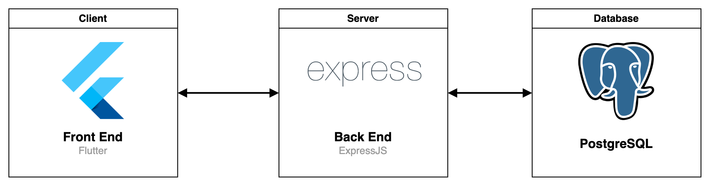

# Listly

### Listly é um aplicativo móvel que gerencia listas de tarefas. Ele foi feito como requisito parcial para obtenção do título de Bacharel na [URI](https://www.uricer.edu.br/site/).

## Sobre
Listly é basicamente um aplicativo que gerencia listas de tarefas. Devido ao curto tempo de desenvolvimento, o aplicativo é basicamente um MVP. O usuário pode se cadastrar na plataforma, gerenciar grupos de listas, listas e seus respectivos itens.

## Arquitetura
A arquitetura base do sistema é apresentada da seguinte forma:

* **Client** - Cliente da aplicação feito com Flutter, o código fonte está no repositório [listly-app](https://github.com/Listly-org/listly-app) repository;
* **Server** - Servidor da aplicação feito em Express, o código fonte está no repositório [listly-api](https://github.com/Listly-org/listly-api);
* **Database** - Banco de dados da aplicação em PostgreSQL;

## Repositórios
* [**listly-app**](https://github.com/Listly-org/listly-app) - Front-end da aplicação feito em Flutter;
* [**listly-api**](https://github.com/Listly-org/listly-api) - Back-end da aplicação feito em Express;